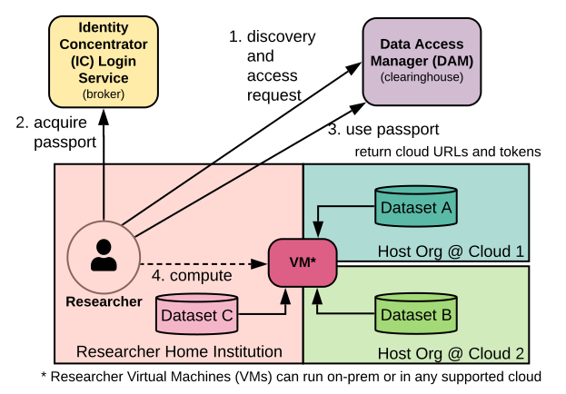
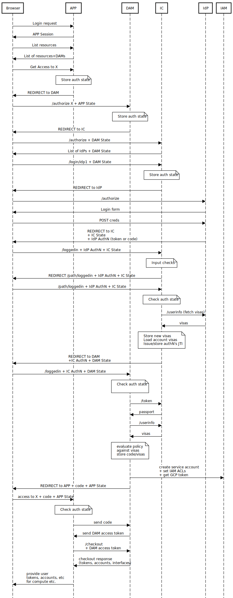

# Data Access Manager Technical Guide

## Introduction

[Data Access Manager](https://github.com/GoogleCloudPlatform/healthcare-federated-access-services#data-access-manager) (DAM) provides a mechanism for users -- such as
researchers -- to get access to cloud resources using identities and
permissions/qualifications carried on their access tokens from upstream
[Identity Providers](https://en.wikipedia.org/wiki/Identity_provider).

## Researcher Cloud User Journey



In the above diagram, a researcher wishes to run a Virtual Machine (VM) in their
home organization or in a public cloud supported by DAM, or multiple VMs some
combination of places:

1.  Perform discovery of available datasets.
    *  Determine which datasets the DAM has available.
    *  The user or a tool of their choosing collects datasets that should be
       allowed given the researcher's status and controlled access grants from
       Data Access Committees (DACs).
    *  Initiate a request to DAM for access to the dataset collection desired.

1.  The user is redirected to get Passports and Visas from appropriate locations
    for the given collection of datasets being requested.
    *  The user chooses an Identity Provider to authenticate with (i.e. login).
    *  Once the login successfully completes, the Identity Concentrator (IC)
       or other compliant Passport Broker packages up Passport Visas for use
       by the DAM.

1.  The user is redirected back to the DAM to complete the request to access
    the collection of datasets.
    *  DAM decides if the request meets the policy requirements of all datasets
       being requested.
    *  DAM allocates a "DAM access token" that can be used to get cloud
       resources for the collection of datasets.
    *  The application calls the DAM API `checkout` endpoint to get cloud
       resource URLs, tokens, and interface information.

1.  The user starts a compute job on a set of VMs.
    *  The user directly or via the application takes steps to grab the cloud
       URLs and related tokens and provide them as inputs to the VM(s).
    *  VM(s) may run on premises (i.e. in the researcher's home institution or
       private cloud), or on any supported public cloud, or some combination
       thereof.
    *  VM(s) use different tokens or signed URLs to access resources across
       clouds as needed with the appropriate ACLs and billing settings.

## DAM Resource Configuration

The user can discover a set of resources that are published by a DAM. This can
include multiple datasets where each dataset may provide multiple views:

*  A `view` may provide a slice of data within a resource. All resources
   **must** have a view, even if that view is named "all" and provides all the
   files or tables for that resource.
*  Each view may provide only one resource service type, such as GCS buckets or
   BigQuery tables but not both. If a `resource` consists of multiple service
   type items, then multiple views must be used to include them within the same
   `resource` within DAM.
*  Each view has a list of `items` associated with it. The fields that are
   provided for an `item` vary based on the service type. For example, GCS
   bucket items provide `project` and `bucket` whereas BigQuery items provide
   `project` and `table`.
*  Some `item` fields are required and others are optional. Each service type
   that DAM supports also publishes a `service descriptor` indicating what
   fields its `items` understand, and which of those fields are optional.

For example, one `view` of a `resource` may contain two GCS bucket `items` and
another `view` of that same resource may contain three BigQuery table `items`.

Each `view` publishes a set of available `roles`:

*  Each `role` indicates a different access level on the data.
*  Each `role` provides a different set of policies that the user must meet in
   order to gain access to that role.
   * Users typically meet policy criteria by presenting a set of Passport Visas
     that prove that the criteria have been met.
   * DAM also provides an email address whitelisting mechanism to allow a small
     set of users to share data in the prepublication phase of a dataset before
     visas have been established.
   * Whitelists and visas cannot be used within the same view of the data.
*  For example, a view can publish three roles: `beacon`, `viewer`, and
   `editor`.
   *  `beacon` could represent a GA4GH Beacon discovery service that provides a
       way for users to discover if particular genomic variants are present
       within a dataset with low-risk of exposing PHI, yet still limit the use
       of this service to qualified Registered Access bona fide researchers.
   *  `viewer` could represent read access to the bytes of all items within the
      view.
   *  `editor` could represent read/write access to the items within the view.
*  In advanced configurations, `service templates` can be edited to expose
   various roles for any given service type. Service templates do the work of
   taking a role like `viewer` and mapping it to roles on the underlying cloud
   platform that stores the data.

Cloud services, represented by the `service template`, may expose a set of
`interfaces` for the user to select:

*  Each `interface` represents a protocol or other mechanism to access the data.
*  For example, the `gcs` service template exposes two interfaces:
   1.  `gcp:gs` for using the GCS `gsutil` command line tool.
   1.  `http:gcp:gs` for using the GCS RESTful API.

## Auth Details for Requesting Access to Resources

Much like described in the
[Researcher Cloud User Journey](#researcher-cloud-user-journey), each client
application to DAM may redirect the user to DAM's `auth` endpoint to get access
to a set of resources. The user and/or the application would typically select a
set of resources, views, roles, and interfaces. This set of resources may
provide a set of access tokens and metadata for how to use them that include
multiple services and multiple public clouds within a single, multi-layered auth
flow.

There are three layers to the auth flow journey for the user. Each layer uses
the OpenID Connect (OIDC) protocol to obtain the identity and permissions
associated with the user:

1.  DAM's `auth` endpoint takes in a set of resource paths where each path
    contains the resource name, view name, role name, and interface name that
    the user is requesting. The user will be redirected to the 2nd layer of auth
    to obtain a Passport that covers the scope of the Visa requirements for all
    policies involved in that resource set. The default DAM configuration uses
    the Identity Concentrator (IC) to obtain this Passport via the
    `DEFAULT_BROKER` environment variable.

1.  IC's `auth` endpoint acquires a Passport to represent the user. It allows
    account linking so the user can login once and get access to a set of Visas
    across multiple accounts. The IC is an Identity Broker, meaning that it does
    not provide authentication natively but instead it is configured to provide
    a set of upstream Identity Providers (IdPs) to perform this step.
    *  The IC can request the `ga4gh_passport_v1` scope from upstream IdPs to
       acquire their Visas, then merge Visas from multiple linked accounts.
    *  The IC generates its own Passport, including its own identity for the
       user. This identity represents the user across all of the upstream IdPs
       that the user may choose to use as a source of Visas. In some cases,
       there are no Visa-providing upstream IdPs, but the IC can still represent
       the identity for these users.
    *  The IC adds some `LinkedIdentities` Visas to its Passport for users. This
       will include email address and the `subject` as the user is identified by
       upstream IdPs.
    *  The IC's Passport does not contain the visas, but allows access to them
       via the `ga4gh_passport_v1` scope via the `userinfo` endpoint. This
       allows the content of the Passport to be many kilobytes in size, but
       still allows the IC's `access token` to be small enough to be included as
       a bearer token on requests throughout the Passport service network.

1.  The upstream Identity Provider authenticates the user and provides any Visas
    it may have on the user.

Each layer of auth provides an opportunity for the user to agree to the release
of information to the previous layer in the chain. The user may choose not to
share some information if they feel it is unnecessary. Depending on what
information is shared, DAM policies guarding access to resources may not be
provided the information they need to permit access.

The OIDC flows listed above typically use the `code flow` mechanism to exchange
information. The code flow allows the minimal information needed to be exposed
to the user and their browser or other tool of reference as part of these flows.
For example:

*   The `icdemo` application ends up getting a `code` for an IC Passport, then
    the application uses it to show the user their passport, but does not get
    exposed to the IdPs access token directly.
*   The `damdemo` application ends up getting a `code` for a DAM access token,
    and does not get exposed to the IC Passport nor the upstream IdP access
    token directly.

**Tip:** See [Appendix A](#appendix-a-three-layer-auth-flow) for a full sequence
diagram of a user going through a three layer auth flow with these services.

## DAM checkout

After the auth flows have completed successfully, the user will have an access
token to DAM. This bearer token may be used by the `checkout` endpoint in DAM to
get access to the set of cloud access tokens and metadata for the resources
requested by that auth flow.

For example, the output of `checkout` may look something like this:

```
{
  "resources": {
    "https://dam-github-dot-project-example.appspot.com/dam/master/resources/test-dataset/views/gcs_read/roles/viewer/interfaces/gcp:gs": {
      "interfaces": {
        "gcp:gs": {
          "items": [
            {
              "uri": "gs://project-example-test-dataset",
              "labels": {
                "fidelity": "normalized",
                "geoLocation": "gcp:na/us/us-central1/us-central1-a",
                "partition": "all",
                "platform": "gcp",
                "topic": "variants",
                "version": "1.0"
              }
            }
          ]
        },
        "http:gcp:gs": {
          "items": [
            {
              "uri": "https://www.googleapis.com/storage/v1/b/project-example-test-dataset",
              "labels": {
                "fidelity": "normalized",
                "geoLocation": "gcp:na/us/us-central1/us-central1-a",
                "partition": "all",
                "platform": "gcp",
                "topic": "variants",
                "version": "1.0"
              }
            }
          ]
        }
      },
      "access": "0",
      "permissions": [
        "list",
        "metadata",
        "read"
      ]
    }
  },
  "access": {
    "0": {
      "credentials": {
        "access_token": "ya29.xxxxxxxxxxxxxxxxxxxxxxxxxx...",
        "account": "ixxxxxxxxxxxxxxxxxxxxxxx@project-example.iam.gserviceaccount.com"
      }
    }
  },
  "epochSeconds": 1584014173
}
```

## DAM Demo

If installing the full "playground" functionality (i.e. this is done by default
if using deploy.bash), the DAM Demo page can be a useful tool to get comfortable
with how these flows work in practice.

1.  Visit `damdemo-dot-<project-id>.appspot.com/test` or, if you used an
    `environment` name as part of your deployment, visit
    `damdemo-<environment-name>-dot-<project-id>.appspot.com/test` instead.
1.  Click the `Include Resource` button for the default dropdowns. This will
    prepare one resource, view, role, and interface to send to the DAM `auth`
    endpoint.
1.  Click `Auth for Resources` to start the DAM `auth` flow.
1.  Follow the various steps presented through the DAM, IC, and IdP layers.
    *  In this case, choose the "Persona Playground" as the IdP when prompted,
       and do not use the "Google" IdP.
    *  When on the "Persona Playground" login page, choose "NCI Researcher"
       since this persona has the required Visa to meet the access policy for
       the selected resource.
    *  When prompted to release scopes, including Visas, click `Agree`.
1.  Once you have returned to the `damdemo` test page without errors, the
    `Cart Tokens` button should turn blue. Click it to have the test page call
    the DAM's `checkout` endpoint.
1.  After 1 to 3 seconds, you should see a table filled in with one row per
    requested resource URI.
    *  Below the table, you will see the `checkout` response JSON that was used
       to fill in the table.
    *  The table contains a clickable "path" that lets to test out the access
       token provided for the GCS bucket.
1.  Click the `https://www.googleapis.com/storage/v1/b/...` clickable text in
    the "path" column. The output below should change to show the metadata for
    the file(s) contained within the bucket.

**Note:** that the DAM refresh token provided is valid for only a very short
period by default.

## Importing config changes

In addition to using the administration config API, it is possible to replace
the IC configuration or DAM configuration from file into the data storage layer.
Also note that if a system is using the Persona Broker to allow users to
impersonate mock users, updates can only be done via file-based configurations.

For example, to allow the administrator to have `viewer` access to the default
dataset provided by the default configuration, the steps to roll this out from
files like this:

1.  Edit the `deploy/config/dam-template/config_master_main_latest.json` file.
1.  Under the `personas` section, replace the `administrator` persona with the
    following:

       ```
       "administrator": {
         "ui": {
           "label": "Administrator"
         },
         "passport": {
           "standardClaims": {
             "iss": "https://ic-${YOUR_PROJECT_ID}.appspot.com/oidc",
             "email": "admin@nci.nih.gov",
             "picture": "/identity/static/images/nih_identity.jpeg"
           },
           "ga4ghAssertions": [
             {
               "type": "ControlledAccessGrants",
               "source": "https://dbgap.nlm.nih.gov/aa",
               "value": "https://dac.nih.gov/datasets/phs000710",
               "assertedDuration": "1d",
               "expiresDuration": "30d",
               "by": "dac"
             }
           ]
         },
         "access": [
           "test-dataset/gcs_read/viewer"
         ]
       }
       ```
1.  Redeploy the Persona Broker (use the same `environment` as you used to
    deploy, or remove the `-e <environment>` all together if you did not use the
    environment feature):

       ```
       ./deploy.bash -e <environment> personas
       ```

Other than the Persona Broker, any changes you make to files will need to be
re-imported to replace existing configs.

**CAUTION:** This will wipe out any other changes you have made to the
configuration. Exercise extreme caution when using the `import` command with
production systems and validate the configs are correct before pushing them to
deployments.

```
./import.bash -p <project> -e <environment> -t <import_type> ic
```

or

```
./import.bash -p <project> -e <environment> -t <import_type> dam
```

## Appendix A: Three Layer Auth Flow

Full APP/DAM/IC/IdP cloud resource request flow



